  

  
  &nbsp;
  

---

## 🇧🇷 Português

<table>
  <tr>
    <td width="240" align="center" valign="middle">
      
    </td>
    <td valign="middle">
      <h2>Olá, eu sou o Caio 👾</h2>
      

        Engenheiro Backend Sênior com <b>8+ anos</b> de experiência construindo sistemas distribuídos em <b>Java + Spring</b> sobre <b>GCP / AWS</b>. Atuei em <b>utilidade pública</b>, <b>varejo farmacêutico</b> e <b>fintech</b>. Hoje caminhando para <b>Arquiteto de Software</b>.
      

      
📍 Brasília — DF &nbsp;|&nbsp; 🍵 Tea-powered &nbsp;|&nbsp; ⛪ Católico &nbsp;|&nbsp; ⚜️ Escoteiro

    </td>
  </tr>
</table>

  

### 🌟 Sobre mim

- 🛠️ **8+ anos** desenvolvendo backend Java de missão crítica
- 🏗️ Sênior caminhando para **Arquiteto de Software**
- 🌐 Setores: **utilidade pública**, **varejo farmacêutico** e **fintech**
- ☁️ Especialista em **Java/Spring** sobre **GCP** e **AWS**
- 📚 Aprendiz vitalício: hoje estudando arquitetura, DDD, eventos e AWS DVA-C02
- 🎓 Bacharel em Ciência da Computação (UCB) + Pós Full-Stack (PUCRS) + Pós Mobile/Flutter (FACON)

> Atuo simultaneamente em projetos PJ para empresas dos setores acima. Por compromissos contratuais, não cito clientes nominalmente — mas a stack abaixo reflete o que entrego em produção todos os dias.

  

### 🛠️ Stack técnica

**Backend**

  
  
  

**Cloud & Infra**

**Data**

**DevOps & Tooling**

**Frontend & Outros**

**Mobile (legado)**

> Também trabalho com: **Oracle**, **AlloyDB**, **ActiveMQ**, **Pub/Sub**, **Keycloak**, **WildFly**, **JUnit**, **Mockito**, **JaCoCo**, **JSF**.

### 🎓 Formação & Certificações

| Período      | Instituição | Curso                                    |
|--------------|-------------|------------------------------------------|
| 2024 — 2025  | PUCRS       | Pós em Desenvolvimento Full-Stack        |
| 2022 — 2023  | FACON       | Pós em Desenvolvimento Mobile (Flutter)  |
| 2022 — 2023  | WiseUp      | Inglês intermediário                     |
| 2018 — 2021  | UCB         | Bacharelado em Ciência da Computação     |

**Certificações**

- ✅ AWS Certified Cloud Practitioner (2024)
- 🟡 AWS Certified Developer — Associate (em andamento)

### 🚀 Atualmente estudando

- ☁️ AWS Certified Developer — Associate
- 🏛️ Arquitetura de Software, DDD e Event-Driven Architecture
- ⚡ Java 21/25 LTS (Virtual Threads, Records, Pattern Matching)
- 🧪 Testes de contrato e arquitetura hexagonal

### 📊 Estatísticas

  
  

  

### 📈 Atividade dos últimos 31 dias

  

### 🌌 Always coding

  

### 🛸 Repos em destaque

  
  

  
  

  
  

### 🌌 Vida além do código

- ⛪ **Católico** praticante
- ⚜️ **Escoteiro** — valores que carrego para a engenharia
- 👨‍👩‍👧‍👧 Marido e pai de **duas filhas**
- 🐱 4 gatos · 🐶 3 cachorros (a casa é movimentada)
- 🎸 John Mayer, Noah Kahan no repeat
- 🚛 Euro Truck Simulator 2 · ⭐ Star Wars · 🔫 CS:GO · ⚽ Futebol
- 📓 Vivo no [Notion](https://caiocv18.notion.site/)

### 📡 Contato

  
  
  
  
  

## 🇺🇸 English

<table>
  <tr>
    <td width="240" align="center" valign="middle">
      
    </td>
    <td valign="middle">
      <h2>Hi, I'm Caio 👾</h2>
      

        Senior Backend Engineer with <b>8+ years</b> of experience building distributed systems in <b>Java + Spring</b> on <b>GCP / AWS</b>. I've worked across <b>public utilities</b>, <b>pharma retail</b> and <b>fintech</b>. Currently transitioning into <b>Software Architect</b>.
      

      
📍 Brasília — Brazil &nbsp;|&nbsp; 🍵 Tea-powered &nbsp;|&nbsp; ⛪ Catholic &nbsp;|&nbsp; ⚜️ Boy Scout

    </td>
  </tr>
</table>

  

### 🌟 About me

- 🛠️ **8+ years** building mission-critical Java backends
- 🏗️ Senior engineer transitioning into **Software Architect**
- 🌐 Domains: **public utilities**, **pharma retail**, **fintech**
- ☁️ Specialist in **Java/Spring** on **GCP** and **AWS**
- 📚 Lifelong learner: currently studying architecture, DDD, event-driven systems and AWS Developer Associate
- 🎓 BSc Computer Science (UCB) + Full-Stack postgrad (PUCRS) + Mobile/Flutter postgrad (FACON)

> I currently deliver across **public utilities**, **pharma retail** and **fintech** clients. Due to contractual commitments, I do not name them publicly — but the stack below is what I run in production every day.

  

### 🛠️ Tech stack

**Backend**

  
  
  

**Cloud & Infra**

**Data**

**DevOps & Tooling**

**Frontend & Others**

**Mobile (legacy)**

> Also experienced with: **Oracle**, **AlloyDB**, **ActiveMQ**, **Pub/Sub**, **Keycloak**, **WildFly**, **JUnit**, **Mockito**, **JaCoCo**, **JSF**.

### 🎓 Education & Certifications

| Period       | Institution | Program                                  |
|--------------|-------------|------------------------------------------|
| 2024 — 2025  | PUCRS       | Full-Stack Development (postgrad)        |
| 2022 — 2023  | FACON       | Mobile Development with Flutter (postgrad) |
| 2022 — 2023  | WiseUp      | Intermediate English                     |
| 2018 — 2021  | UCB         | BSc in Computer Science                  |

**Certifications**

- ✅ AWS Certified Cloud Practitioner (2024)
- 🟡 AWS Certified Developer — Associate (in progress)

### 🚀 Currently learning

- ☁️ AWS Certified Developer — Associate
- 🏛️ Software Architecture, DDD and Event-Driven Architecture
- ⚡ Java 21/25 LTS (Virtual Threads, Records, Pattern Matching)
- 🧪 Contract testing and hexagonal architecture

### 📊 Stats

  
  

  

### 📈 Activity over the last 31 days

  

### 🌌 Always coding

  

### 🛸 Featured repos

  
  

  
  

  
  

### 🌌 Life beyond code

- ⛪ Practicing **Catholic**
- ⚜️ **Boy Scout** — values I carry into engineering
- 👨‍👩‍👧‍👧 Husband and father of **two daughters**
- 🐱 4 cats · 🐶 3 dogs (busy household)
- 🎸 John Mayer and Noah Kahan on repeat
- 🚛 Euro Truck Simulator 2 · ⭐ Star Wars · 🔫 CS:GO · ⚽ Football
- 📓 I live on [Notion](https://caiocv18.notion.site/)

### 📡 Contact

  
  
  
  
  

<!-- 🎧 Spotify Now Playing — descomentar após setup do widget
### 🎧 Now Playing

  

Setup steps:
1. Create Spotify App at https://developer.spotify.com/dashboard
   (Redirect URI: http://127.0.0.1:80/callback)
2. Note Client ID + Client Secret
3. Run OAuth flow to obtain refresh_token (scope: user-read-currently-playing,user-read-recently-played)
4. Fork tthn0/Spotify-Readme → deploy to PythonAnywhere (free) or Vercel
5. Set env vars CLIENT_ID, CLIENT_SECRET, REFRESH_TOKEN
6. Replace YOUR_DEPLOYED_URL above and uncomment this block
-->

